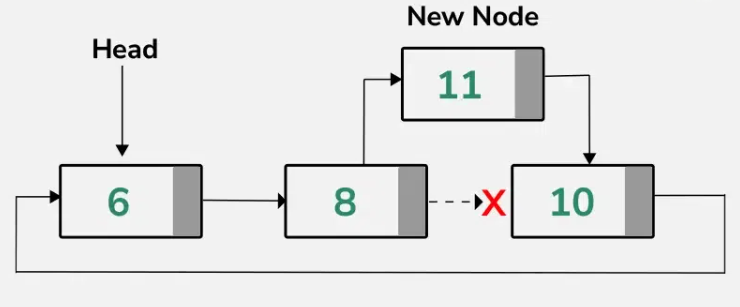

# Lab: Circular Linked List in C++

## Introduction
A Circular Linked List (CLL) is a data structure where the last node of the list points back to the first node, forming a circle. Unlike a singly or doubly linked list, it has no definitive start or end, which allows continuous traversal through the list.

### Circular Linked List Representation**
```
Head -> Node1 -> Node2 -> ... -> NodeN -> Head
```


## **Node Structure in C++**
The structure of a node in a circular linked list can be defined as:
```cpp
struct Node {
    int data;
    Node* next;
    Node(int value) : data(value), next(nullptr) {}
};
```
Each node contains:
- `data`: The value stored in the node.
- `next`: A pointer to the next node in the list.

## **Common Operations in CLL**
a. **Insertion**
   - At the beginning
   
   

   - At the end

   

   - After a specific node

   


b. **Deletion**
   - From the beginning

   

   - From the end

   

c. **Traversal**
   - Print all nodes starting from the head.

d. **Search**
   - Check if a value exists in the list.

## **Code Implementation in C++ with Dry Runs and Explanations**

### 5.1 Insert at Beginning
**Algorithm:**
1. Create a new node and assign the value.
2. If the list is empty, make the new node point to itself and set it as the head.
3. Otherwise, traverse to the last node, update its `next` pointer to point to the new node.
4. Set the `next` of the new node to the head and update the head pointer.

**Code:**
```cpp
void insertAtBeginning(Node*& head, int value) {
    Node* newNode = new Node(value);
    if (head == nullptr) { // Empty list
        newNode->next = newNode;
        head = newNode;
    } else {
        Node* temp = head;
        while (temp->next != head) { // Traverse to the last node
            temp = temp->next;
        }
        temp->next = newNode;       // Update last node's next pointer
        newNode->next = head;       // Point new node to the head
        head = newNode;             // Update head to the new node
    }
}
```
**Dry Run:**
| Step | Action                  | Head |
|------|-------------------------|------|
| 1    | Create a node with 10   | 10 -> 10 |
| 2    | Point newNode->next to head | 10 -> 20 -> 10 |

### 5.2 Insert at End
**Algorithm:**
1. Create a new node and assign the value.
2. If the list is empty, make the new node point to itself and set it as the head.
3. Otherwise, traverse to the last node, update its `next` pointer to point to the new node.
4. Set the `next` of the new node to the head.

**Code:**
```cpp
void insertAtEnd(Node*& head, int value) {
    Node* newNode = new Node(value);
    if (head == nullptr) { // Empty list
        newNode->next = newNode;
        head = newNode;
    } else {
        Node* temp = head;
        while (temp->next != head) { // Traverse to the last node
            temp = temp->next;
        }
        temp->next = newNode; // Link last node to the new node
        newNode->next = head; // Point new node to the head
    }
}
```

### 5.3 Delete a Node
**Algorithm:**
1. If the list is empty, print a message and return.
2. If deleting the head node:
   - Traverse to the last node.
   - Update the last node's `next` to the next of head.
   - Update the head pointer and delete the old head.
3. Otherwise, traverse to the node before the target node, update its `next` to skip the target node, and delete the target node.

**Code:**
```cpp
void deleteNode(Node*& head, int value) {
    if (head == nullptr) { // Empty list
        cout << "List is empty!\n";
        return;
    }
    Node* temp = head;
    Node* prev = nullptr;
    do {
        if (temp->data == value) {
            if (temp == head) { // Deleting head node
                Node* tail = head;
                while (tail->next != head) { // Traverse to the last node
                    tail = tail->next;
                }
                if (tail == head) { // Only one node in the list
                    delete head;
                    head = nullptr;
                } else {
                    tail->next = head->next;
                    delete head;
                    head = tail->next;
                }
            } else { // Deleting non-head node
                prev->next = temp->next;
                delete temp;
            }
            return;
        }
        prev = temp;
        temp = temp->next;
    } while (temp != head);
    cout << "Value not found!\n";
}
```

### 5.4 Traverse the List
**Code:**
```cpp
void traverse(Node* head) {
    if (head == nullptr) {
        cout << "List is empty!\n";
        return;
    }
    Node* temp = head;
    do {
        cout << temp->data << " -> ";
        temp = temp->next;
    } while (temp != head);
    cout << "(back to head)\n";
}
```

##  **Applications**
- Task Scheduling: Round-robin algorithms.
- Memory Management: Buffer management in operating systems.
- Multiplayer Games: Managing players in a circular turn system.

##  **Time Complexity Analysis**
| Operation | Time Complexity |
|-----------|-----------------|
| Insertion | O(n)           |
| Deletion  | O(n)           |
| Traversal | O(n)           |

## **Conclusion**
Circular Linked Lists provide an efficient way to manage circular processes or real-time applications. Their continuous traversal property makes them ideal for many specialized scenarios.

```cpp
#include <iostream>
using namespace std;

// Node structure
struct Node {
    int data;
    Node* next;
    Node(int value) : data(value), next(nullptr) {}
};

// Insert at the beginning
void insertAtBeginning(Node*& head, int value) {
    Node* newNode = new Node(value);
    if (head == nullptr) { // Empty list
        newNode->next = newNode;
        head = newNode;
    } else {
        Node* temp = head;
        while (temp->next != head) { // Traverse to the last node
            temp = temp->next;
        }
        temp->next = newNode;       // Update last node's next pointer
        newNode->next = head;       // Point new node to the head
        head = newNode;             // Update head to the new node
    }
}

// Insert at the end
void insertAtEnd(Node*& head, int value) {
    Node* newNode = new Node(value);
    if (head == nullptr) { // Empty list
        newNode->next = newNode;
        head = newNode;
    } else {
        Node* temp = head;
        while (temp->next != head) { // Traverse to the last node
            temp = temp->next;
        }
        temp->next = newNode; // Link last node to the new node
        newNode->next = head; // Point new node to the head
    }
}

// Delete a node by value
void deleteNode(Node*& head, int value) {
    if (head == nullptr) { // Empty list
        cout << "List is empty!\n";
        return;
    }
    Node* temp = head;
    Node* prev = nullptr;
    do {
        if (temp->data == value) {
            if (temp == head) { // Deleting head node
                Node* tail = head;
                while (tail->next != head) { // Traverse to the last node
                    tail = tail->next;
                }
                if (tail == head) { // Only one node in the list
                    delete head;
                    head = nullptr;
                } else {
                    tail->next = head->next;
                    delete head;
                    head = tail->next;
                }
            } else { // Deleting non-head node
                prev->next = temp->next;
                delete temp;
            }
            return;
        }
        prev = temp;
        temp = temp->next;
    } while (temp != head);
    cout << "Value not found!\n";
}

// Traverse the list
void traverse(Node* head) {
    if (head == nullptr) {
        cout << "List is empty!\n";
        return;
    }
    Node* temp = head;
    do {
        cout << temp->data << " -> ";
        temp = temp->next;
    } while (temp != head);
    cout << "(back to head)\n";
}

// Main function to demonstrate operations
int main() {
    Node* head = nullptr;

    // Insert elements
    insertAtBeginning(head, 10);
    insertAtBeginning(head, 20);
    insertAtEnd(head, 30);
    insertAtEnd(head, 40);

    // Traverse the list
    cout << "Circular Linked List: ";
    traverse(head);

    // Delete an element
    cout << "Deleting 20...\n";
    deleteNode(head, 20);
    cout << "After Deletion: ";
    traverse(head);

    // Delete head
    cout << "Deleting 10 (head)...\n";
    deleteNode(head, 10);
    cout << "After Deletion: ";
    traverse(head);

    // Delete remaining elements
    cout << "Deleting all remaining elements...\n";
    deleteNode(head, 30);
    deleteNode(head, 40);
    cout << "After Deletion: ";
    traverse(head);

    return 0;
}
```


