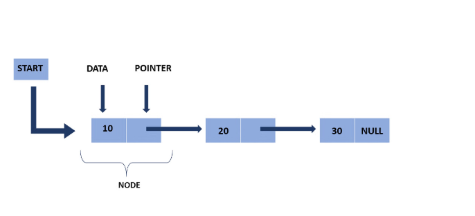

# Lab: Comprehensive Implementation of Singly Linked List in C++

## 1. Introduction to Singly Linked List
A **Singly Linked List** is a linear data structure where each node contains:
- **Data**: Stores the value.
- **Next Pointer**: Points to the next node in the list.
- The last node's `next` pointer points to `NULL`.
- The first node in a linked list is typically called the **head**, and it serves as the starting point for traversing the list. The last node's reference points to `NULL`, indicating the end of the list.

A linked list is a linear data structure in which elements, called nodes, are connected together through a set of pointers. Unlike arrays, which store elements in contiguous memory locations, linked lists allow elements to be scattered throughout memory. Each node in a linked list contains two components:
### Linked List Diagram


The diagram above illustrates the structure of a singly linked list. Each node consists of a **data** part and a **pointer**, with the last node pointing to `NULL`.

## 3. Types of Linked Lists
There are several types of linked lists, each with its own characteristics. The most common types include:

1. **Singly Linked List**: In this type of list, each node points to the next node in the sequence.
2. **Doubly Linked List**: Each node in a doubly linked list contains pointers to both the next and the previous nodes, allowing for bidirectional traversal.
3. **Circular Linked List**: In this variant, the last node's reference points back to the first node, forming a closed loop.

## 4. Operations on Linked Lists
### Insertion
1. **Insert at the Beginning**: Add a new node to the start of the list by updating the head pointer.
2. **Insert at the End**: Traverse the list until the last node and update its reference to the new node.
3. **Insert at a Specific Position**: Add a node at a specified position by updating the references of adjacent nodes.

### Deletion
1. **Delete from the Beginning**: Remove the first node by updating the head pointer.
2. **Delete from the End**: Traverse the list to find the second-to-last node and update its reference.
3. **Delete at a Specific Position**: Remove a node at a specific position by updating references to skip the target node.

### Traversal
1. **Forward Traversal**: Start from the head node and visit each element sequentially.
2. **Reverse Traversal**: Only possible in doubly linked lists by starting from the tail.

### Searching
Search for a specific element by iterating through the nodes until the target data is found.

### Size and Length
Count the number of nodes by traversing the list.

### Concatenation
Combine two linked lists by updating the last node of the first list to point to the head of the second list.

## 5. Practical Applications of Linked Lists
- **Dynamic Memory Allocation**: Used in programming languages for efficient memory management.
- **Stacks and Queues**: Underlying data structure for implementing these concepts.
- **Undo/Redo Functionality**: Used in software for reversing user actions.

## 6. Conclusion
Linked lists are a fundamental data structure with a wide range of applications. Understanding their operations and practical uses is essential for efficient programming.

---

## 2. Benefits of Linked Lists
1. **Dynamic Size**: Memory allocation is dynamic and can grow/shrink as needed.
2. **Efficient Insertions/Deletions**: Inserting or deleting a node is efficient as there is no need to shift elements.
3. **No Memory Wastage**: Utilizes memory efficiently, unlike arrays, which may have unused reserved space.

---

## 3. Applications of Linked Lists
1. Implementation of **Stacks, Queues, and Graphs**.
2. **Dynamic Memory Allocation** in operating systems.
3. Efficient data manipulation where frequent insertions/deletions are needed.
4. **Symbol Table Management** in compilers.

---

## 4. Comparison: Linked List vs. Array

| **Feature**           | **Linked List**                | **Array**                     |
|-----------------------|---------------------------------|-------------------------------|
| **Size**              | Dynamic (grows/shrinks)        | Fixed at initialization.      |
| **Insertion/Deletion**| Efficient                      | Requires shifting elements.   |
| **Random Access**     | Not possible                   | Possible via indexing.        |
| **Memory Allocation** | Scattered in memory            | Contiguous in memory.         |

---

## 5. Time Complexity Analysis

| **Operation**         | **Time Complexity**            |
|-----------------------|---------------------------------|
| **Insertion**         | O(1) at beginning, O(n) at end/position |
| **Deletion**          | O(1) at beginning, O(n) at position |
| **Traversal**         | O(n)                           |
| **Search**            | O(n)                           |


---

## 6. Universally Used Structure for Linked Lists

```cpp
#include <iostream>
using namespace std;

struct Node {
    int data;        // Stores data
    Node* next;      // Pointer to the next node
};

// Functions for various operations
void insertAtBeginning(Node*& head, int value);
void insertAtEnd(Node*& head, int value);
void insertAtPosition(Node*& head, int position, int value);
void deleteNode(Node*& head, int value);
void traverseList(Node* head);
void sortList(Node*& head);
```

## 7. Detailed Implementation

### 7.1 Insert at Beginning

#### Algorithm
1. Create a new node.
2. Assign the value to the node's `data`.
3. Set `newNode->next` to the current `head`.
4. Update the `head` to point to `newNode`.

#### Code with Line-by-Line Explanation
```cpp
void insertAtBeginning(Node*& head, int value) {
    Node* newNode = new Node();   // Step 1: Create a new node
    newNode->data = value;        // Step 2: Assign value to the node
    newNode->next = head;         // Step 3: Link new node to the current list
    head = newNode;               // Step 4: Update head to point to new node
}
```

#### Detailed Dry Run
- **Initial List**: `NULL`
- **Input**: `insertAtBeginning(head, 10)`
- **Steps**:
  1. Create a new node with `data = 10`.
  2. Point `newNode->next` to `head` (currently `NULL`).
  3. Update `head` to point to `newNode`.
- **Result**: `10 -> NULL`

---

### 7.2 Insert at End

#### Algorithm
1. Create a new node.
2. Assign the value to the node's `data`.
3. Set `newNode->next` to `NULL`.
4. If the list is empty, set `head` to `newNode`.
5. Otherwise, traverse to the last node.
6. Update the last node’s `next` to point to `newNode`.

#### Code with Line-by-Line Explanation
```cpp
void insertAtEnd(Node*& head, int value) {
    Node* newNode = new Node();   // Step 1: Create a new node
    newNode->data = value;        // Step 2: Assign value to the node
    newNode->next = NULL;         // Step 3: Point new node to NULL
    if (head == NULL) {           // Step 4: Check if the list is empty
        head = newNode;           // Step 5: Update head if list is empty
    } else {
        Node* temp = head;        // Step 6: Start at the head
        while (temp->next != NULL) { // Step 7: Traverse to the last node
            temp = temp->next;
        }
        temp->next = newNode;     // Step 8: Link the last node to the new node
    }
}
```

#### Detailed Dry Run
- **Initial List**: `10 -> NULL`
- **Input**: `insertAtEnd(head, 20)`
- **Steps**:
  1. Create a new node with `data = 20`.
  2. Traverse to the last node (`10`).
  3. Set `lastNode->next` to the new node.
- **Result**: `10 -> 20 -> NULL`

---

### 7.3 Delete a Node

#### Algorithm
1. If the list is empty, print a message and exit.
2. If the first node contains the value:
   - Update `head` to `head->next`.
   - Delete the first node.
3. Traverse to the node before the one to delete.
4. Update `temp->next` to skip the node to delete.
5. Delete the unwanted node.

#### Code with Line-by-Line Explanation
```cpp
void deleteNode(Node*& head, int value) {
    if (head == NULL) {             // Step 1: Check if the list is empty
        cout << "List is empty!
"; // Print message if empty
        return;
    }
    if (head->data == value) {      // Step 2: Check if the first node has the value
        Node* temp = head;          // Step 3: Store head in a temporary variable
        head = head->next;          // Step 4: Update head to the next node
        delete temp;                // Step 5: Delete the old head
        return;
    }
    Node* temp = head;              // Step 6: Start at the head
    while (temp->next != NULL && temp->next->data != value) { // Step 7: Traverse to find the value
        temp = temp->next;
    }
    if (temp->next == NULL) {       // Step 8: If value is not found
        cout << "Value not found!
";
    } else {
        Node* delNode = temp->next; // Step 9: Store the node to delete
        temp->next = delNode->next; // Step 10: Skip the node to delete
        delete delNode;             // Step 11: Delete the unwanted node
    }
}
```

#### Detailed Dry Run
- **Initial List**: `10 -> 20 -> NULL`
- **Input**: `deleteNode(head, 20)`
- **Steps**:
  1. Traverse to the node before `20` (`10`).
  2. Update `temp->next` to skip `20` and point to `NULL`.
  3. Delete the node `20`.
- **Result**: `10 -> NULL`

### Traverse and Display a Linked List

#### Algorithm:
1. Initialize a temporary pointer (`temp`) to the head of the list.
2. Traverse the list:
   - While `temp` is not `NULL`:
     - Print the `data` of the current node.
     - Move to the next node.
3. After traversal, print `"NULL"` to indicate the end of the list.

#### Code with Line-by-Line Explanation:
```cpp
void traverseList(Node* head) {
    Node* temp = head;               // Step 1: Initialize temp to the head of the list
    while (temp != NULL) {           // Step 2: Traverse the list until temp is NULL
        cout << temp->data << " -> "; // Step 3: Print the data of the current node
        temp = temp->next;           // Step 4: Move to the next node
    }
    cout << "NULL" << endl;          // Step 5: Print NULL to mark the end of the list
}
```

#### Dry Run:

##### Initial List:  
`10 -> 20 -> 30 -> NULL`  
**Input:** `traverseList(head)`

**Steps:**  
1. **Initialization:**
   - `temp = head`, pointing to the first node (`10`).

2. **First Iteration:**
   - Print `10 ->`.
   - Move `temp` to `temp->next` (node `20`).

3. **Second Iteration:**
   - Print `20 ->`.
   - Move `temp` to `temp->next` (node `30`).

4. **Third Iteration:**
   - Print `30 ->`.
   - Move `temp` to `temp->next` (`NULL`).

5. **Termination:**
   - `temp` is `NULL`, print `"NULL"`.

**Result:**  
Output: `10 -> 20 -> 30 -> NULL`

This function effectively traverses the entire linked list, displaying each node's value in order, followed by `"NULL"` to signify the end.
###  Sort the Linked List

#### Algorithm:
1. Check if the list is empty or contains only one node. If true, exit the function as no sorting is needed.
2. Use two nested loops to compare and sort the list:
   - Outer loop (`i`): Traverses each node of the list up to the second last node.
   - Inner loop (`j`): Traverses from the node after `i` to the end of the list.
3. If the `data` of the `i` node is greater than the `data` of the `j` node:
   - Swap their values.

#### Code with Line-by-Line Explanation:
```cpp
void sortList(Node*& head) {
    if (head == NULL || head->next == NULL) return; // Step 1: Check if the list is empty or has one node
    for (Node* i = head; i->next != NULL; i = i->next) { // Step 2: Outer loop traverses each node
        for (Node* j = i->next; j != NULL; j = j->next) { // Step 3: Inner loop traverses nodes after i
            if (i->data > j->data) { // Step 4: Compare the data of i and j
                swap(i->data, j->data); // Step 5: Swap the data if i > j
            }
        }
    }
}
```

#### Dry Run:

##### Initial List:
`30 -> 10 -> 20 -> NULL`  
**Input:** `sortList(head)`

**Steps:**
1. **Initialization:**
   - `i = head` (node `30`).
   - `j = i->next` (node `10`).

2. **First Pass (Outer Loop `i = 30`):**
   - Compare `30` and `10`:
     - `30 > 10`, so swap. List becomes: `10 -> 30 -> 20 -> NULL`.
   - Compare `30` and `20`:
     - `30 > 20`, so swap. List becomes: `10 -> 20 -> 30 -> NULL`.

3. **Second Pass (Outer Loop `i = 20`):**
   - Compare `20` and `30`:
     - No swap needed as `20 < 30`.

4. **Termination:**
   - Outer loop ends as `i` reaches the second last node.

**Result:**
Output: `10 -> 20 -> 30 -> NULL`

This function sorts the linked list in ascending order using a basic bubble sort algorithm by swapping node data.

```cpp
#include <iostream>
using namespace std;

struct Node {
    int data;        // Stores data
    Node* next;      // Pointer to the next node
};

// Function declarations
void insertAtBeginning(Node*& head, int value);
void insertAtEnd(Node*& head, int value);
void insertAtPosition(Node*& head, int position, int value);
void deleteNode(Node*& head, int value);
void traverseList(Node* head);
void sortList(Node*& head);

// Function implementations

// Insert at the beginning
void insertAtBeginning(Node*& head, int value) {
    Node* newNode = new Node();
    newNode->data = value;
    newNode->next = head;
    head = newNode;
}

// Insert at the end
void insertAtEnd(Node*& head, int value) {
    Node* newNode = new Node();
    newNode->data = value;
    newNode->next = NULL;
    if (head == NULL) {
        head = newNode;
    } else {
        Node* temp = head;
        while (temp->next != NULL) {
            temp = temp->next;
        }
        temp->next = newNode;
    }
}

// Insert at a specific position
void insertAtPosition(Node*& head, int position, int value) {
    Node* newNode = new Node();
    newNode->data = value;
    if (position == 1) {
        newNode->next = head;
        head = newNode;
        return;
    }
    Node* temp = head;
    for (int i = 1; i < position - 1 && temp != NULL; ++i) {
        temp = temp->next;
    }
    if (temp == NULL) {
        cout << "Position out of bounds!" << endl;
        delete newNode;
        return;
    }
    newNode->next = temp->next;
    temp->next = newNode;
}

// Delete a node with a specific value
void deleteNode(Node*& head, int value) {
    if (head == NULL) {
        cout << "List is empty!" << endl;
        return;
    }
    if (head->data == value) {
        Node* temp = head;
        head = head->next;
        delete temp;
        return;
    }
    Node* temp = head;
    while (temp->next != NULL && temp->next->data != value) {
        temp = temp->next;
    }
    if (temp->next == NULL) {
        cout << "Value not found!" << endl;
    } else {
        Node* delNode = temp->next;
        temp->next = delNode->next;
        delete delNode;
    }
}

// Traverse and display the list
void traverseList(Node* head) {
    Node* temp = head;
    while (temp != NULL) {
        cout << temp->data << " -> ";
        temp = temp->next;
    }
    cout << "NULL" << endl;
}

// Sort the list
void sortList(Node*& head) {
    if (head == NULL || head->next == NULL) return;
    for (Node* i = head; i->next != NULL; i = i->next) {
        for (Node* j = i->next; j != NULL; j = j->next) {
            if (i->data > j->data) {
                swap(i->data, j->data);
            }
        }
    }
}

// Main function
int main() {
    Node* head = NULL;

    // Test insert at beginning
    insertAtBeginning(head, 10);
    insertAtBeginning(head, 20);
    traverseList(head);  // Output: 20 -> 10 -> NULL

    // Test insert at end
    insertAtEnd(head, 30);
    insertAtEnd(head, 40);
    traverseList(head);  // Output: 20 -> 10 -> 30 -> 40 -> NULL

    // Test insert at position
    insertAtPosition(head, 3, 25);
    traverseList(head);  // Output: 20 -> 10 -> 25 -> 30 -> 40 -> NULL

    // Test delete node
    deleteNode(head, 10);
    traverseList(head);  // Output: 20 -> 25 -> 30 -> 40 -> NULL

    deleteNode(head, 50); // Value not found!

    // Test sorting
    sortList(head);
    traverseList(head);  // Output: 20 -> 25 -> 30 -> 40 -> NULL

    return 0;
}

```