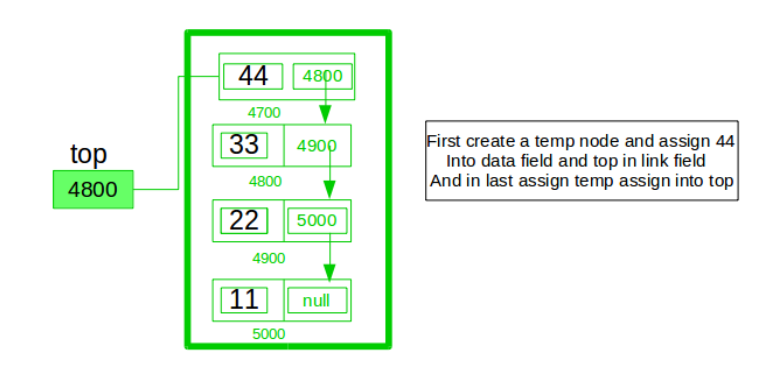

# Stack Implementation Using Linked List

## Introduction
A **stack** is a linear data structure that follows the **LIFO (Last In, First Out)** principle. The last element added to the stack is the first one to be removed. Basic stack operations include:
- **Push**: Add an element to the top.
- **Pop**: Remove the top element.
- **Peek/Top**: View the top element without removing it.
- **isEmpty**: Check if the stack is empty.
### Stack using LinkList Diagram




## Why Use a Linked List for a Stack?
A linked list provides dynamic memory allocation, meaning the stack size can grow or shrink as needed without a predefined limit. This is particularly useful when the maximum size of the stack is unknown.

---

## Node Structure
Each node in the linked list represents an element in the stack. Each node contains:
- **Data**: The actual value of the stack element.
- **Next**: A pointer to the next node in the stack.

---

## Stack Operations
### 1. **Push Operation**
- Create a new node with the given data.
- Set `newNode->next = top` (currently pointing to the old top).
- Update `top` to the new node.

### 2. **Pop Operation**
- Check if the stack is empty (to avoid underflow).
- Store the current `top` node's value.
- Move `top` to `top->next`.
- Delete the old `top` node.

### 3. **Peek Operation**
- Return the data of the `top` node (if not empty).

### 4. **isEmpty Operation**
- Check if `top == nullptr`.

---

## Code Implementation
```cpp
#include <iostream>
using namespace std;

class Node {
public:
    int data;
    Node* next;

    Node(int value) {
        data = value;
        next = nullptr;
    }
};

class Stack {
private:
    Node* top; // Pointer to the top node
public:
    Stack() {
        top = nullptr;
    }

    void push(int value) {
        Node* newNode = new Node(value); // Create a new node
        newNode->next = top;            // Link the new node to the current top
        top = newNode;                  // Update the top pointer
        cout << "Pushed: " << value << endl;
    }

    int pop() {
        if (isEmpty()) {
            cout << "Stack Underflow! Cannot pop from an empty stack." << endl;
            return -1;
        }
        int poppedValue = top->data; // Retrieve the top value
        Node* temp = top;            // Temporarily hold the top node
        top = top->next;             // Move top to the next node
        delete temp;                 // Free the memory
        return poppedValue;
    }

    int peek() {
        if (isEmpty()) {
            cout << "Stack is empty." << endl;
            return -1;
        }
        return top->data;
    }

    bool isEmpty() {
        return top == nullptr;
    }

    void display() {
        if (isEmpty()) {
            cout << "Stack is empty." << endl;
            return;
        }
        Node* temp = top;
        cout << "Stack elements (top to bottom): ";
        while (temp != nullptr) {
            cout << temp->data << " ";
            temp = temp->next;
        }
        cout << endl;
    }
};

int main() {
    Stack stack;

    stack.push(10);
    stack.push(20);
    stack.push(30);

    stack.display();

    cout << "Popped: " << stack.pop() << endl;

    cout << "Top element: " << stack.peek() << endl;

    stack.display();

    return 0;
}
```

---

## Dry Run Example

### **Initial State**
The stack is empty:
```
top = nullptr
```

### **Operations and Memory State**

#### **Step 1: Push 10**
- Create a new node with `data = 10`.
- Set `newNode->next = top` (currently `nullptr`).
- Update `top = newNode`.

**Memory State:**
```
Node: data = 10, next = nullptr
top --> [10]
```

**Console Output:**
```
Pushed: 10
Stack elements (top to bottom): 10
```

---

#### **Step 2: Push 20**
- Create a new node with `data = 20`.
- Set `newNode->next = top` (currently pointing to `[10]`).
- Update `top = newNode`.

**Memory State:**
```
Node: data = 20, next --> [10]
top --> [20] --> [10]
```

**Console Output:**
```
Pushed: 20
Stack elements (top to bottom): 20 10
```

---

#### **Step 3: Push 30**
- Create a new node with `data = 30`.
- Set `newNode->next = top` (currently pointing to `[20]`).
- Update `top = newNode`.

**Memory State:**
```
Node: data = 30, next --> [20]
top --> [30] --> [20] --> [10]
```

**Console Output:**
```
Pushed: 30
Stack elements (top to bottom): 30 20 10
```

---

#### **Step 4: Pop**
- Check if the stack is empty (`top == nullptr`); it is not.
- Store the current `top->data = 30`.
- Move `top` to `top->next` (currently pointing to `[20]`).
- Delete the old `top` node (node with `data = 30`).

**Memory State:**
```
Node: data = 20, next --> [10]
top --> [20] --> [10]
```

**Console Output:**
```
Popped: 30
Stack elements (top to bottom): 20 10
```

---

#### **Step 5: Peek**
- Return `top->data = 20`.

**Console Output:**
```
Top element: 20
```

---

#### **Step 6: Display Final Stack**
**Memory State:**
```
Node: data = 20, next --> [10]
top --> [20] --> [10]
```

**Console Output:**
```
Stack elements (top to bottom): 20 10
```

---

## Applications of Stack
1. **Expression Evaluation and Conversion**: Converting infix to postfix/prefix and evaluating postfix expressions.
2. **Function Call Management**: Used in recursion to store function calls.
3. **Undo/Redo Mechanism**: Track user actions for undo/redo operations.
4. **Balanced Parentheses Checking**: Validate expressions with balanced symbols.
5. **Browser Navigation**: Maintain back and forward navigation history.
6. **Depth-First Search (DFS)**: Used in graph traversal algorithms.

---

## Comparison: Linked List vs Array-Based Stack

| **Feature**             | **Stack Using Linked List**                          | **Stack Using Array**                           |
|-------------------------|-----------------------------------------------------|------------------------------------------------|
| **Memory Allocation**   | Dynamic (grows/shrinks as needed).                  | Static (fixed size unless dynamically resized).|
| **Memory Efficiency**   | No wastage of memory; only used as needed.          | Might waste memory if preallocated size is too large. |
| **Ease of Resizing**    | Easy, as it adjusts dynamically.                    | Requires manual resizing (copying elements).   |
| **Implementation Complexity** | Slightly more complex due to pointer management. | Simpler, as arrays are straightforward.        |
| **Time Complexity**     | O(1) for all operations.                           | O(1) for all operations.                       |
| **Cache Friendliness**  | Less cache-friendly (nodes scattered in memory).    | More cache-friendly (contiguous memory).       |

---

## Time Complexity Analysis
| **Operation** | **Linked List Implementation** | **Array Implementation** |
|---------------|--------------------------------|---------------------------|
| Push          | O(1)                           | O(1)                      |
| Pop           | O(1)                           | O(1)                      |
| Peek          | O(1)                           | O(1)                      |
| isEmpty       | O(1)                           | O(1)                      |

---

## Conclusion
Choosing between a linked list or an array for a stack depends on the use case:
- Use **linked list** when stack size is unpredictable or memory usage needs to be optimized dynamically.
- Use **array** for faster operations and better cache performance when the maximum size of the stack is known beforehand.

# Queue Implementation Using Linked List

## Introduction
A **queue** is a linear data structure that follows the **FIFO (First In, First Out)** principle. The first element added to the queue is the first one to be removed. Basic queue operations include:
- **Enqueue**: Add an element to the rear of the queue.
- **Dequeue**: Remove an element from the front of the queue.
- **Peek/Front**: View the front element without removing it.
- **isEmpty**: Check if the queue is empty.

## Why Use a Linked List for a Queue?
A linked list provides dynamic memory allocation, meaning the queue size can grow or shrink as needed without a predefined limit. This is particularly useful when the maximum size of the queue is unknown.

---

## Node Structure
Each node in the linked list represents an element in the queue. Each node contains:
- **Data**: The actual value of the queue element.
- **Next**: A pointer to the next node in the queue.

---

## Queue Operations
### 1. **Enqueue Operation**
- Create a new node with the given data.
- If the queue is empty, set both `front` and `rear` to the new node.
- Otherwise, link the new node to the current `rear` node and update `rear` to the new node.

### 2. **Dequeue Operation**
- Check if the queue is empty (to avoid underflow).
- Store the current `front` node's value.
- Move `front` to `front->next`.
- If `front` becomes `nullptr`, set `rear` to `nullptr` as well.
- Delete the old `front` node.

### 3. **Peek Operation**
- Return the data of the `front` node (if not empty).

### 4. **isEmpty Operation**
- Check if `front == nullptr`.

---

## Code Implementation
```cpp
#include <iostream>
using namespace std;

class Node {
public:
    int data;
    Node* next;

    Node(int value) {
        data = value;
        next = nullptr;
    }
};

class Queue {
private:
    Node* front; // Pointer to the front node
    Node* rear;  // Pointer to the rear node
public:
    Queue() {
        front = nullptr;
        rear = nullptr;
    }

    void enqueue(int value) {
        Node* newNode = new Node(value); // Create a new node
        if (rear == nullptr) {           // If queue is empty
            front = rear = newNode;
        } else {
            rear->next = newNode;       // Link the new node to the rear
            rear = newNode;             // Update the rear pointer
        }
        cout << "Enqueued: " << value << endl;
    }

    int dequeue() {
        if (isEmpty()) {
            cout << "Queue Underflow! Cannot dequeue from an empty queue." << endl;
            return -1;
        }
        int dequeuedValue = front->data; // Retrieve the front value
        Node* temp = front;             // Temporarily hold the front node
        front = front->next;            // Move front to the next node
        if (front == nullptr) {         // If the queue becomes empty
            rear = nullptr;
        }
        delete temp;                    // Free the memory
        return dequeuedValue;
    }

    int peek() {
        if (isEmpty()) {
            cout << "Queue is empty." << endl;
            return -1;
        }
        return front->data;
    }

    bool isEmpty() {
        return front == nullptr;
    }

    void display() {
        if (isEmpty()) {
            cout << "Queue is empty." << endl;
            return;
        }
        Node* temp = front;
        cout << "Queue elements (front to rear): ";
        while (temp != nullptr) {
            cout << temp->data << " ";
            temp = temp->next;
        }
        cout << endl;
    }
};

int main() {
    Queue queue;

    queue.enqueue(10);
    queue.enqueue(20);
    queue.enqueue(30);

    queue.display();

    cout << "Dequeued: " << queue.dequeue() << endl;

    cout << "Front element: " << queue.peek() << endl;

    queue.display();

    return 0;
}
```

---

## Dry Run Example

### **Initial State**
The queue is empty:
```
front = nullptr
rear = nullptr
```

### **Operations and Memory State**

#### **Step 1: Enqueue 10**
- Create a new node with `data = 10`.
- Since the queue is empty, set both `front` and `rear` to the new node.

**Memory State:**
```
Node: data = 10, next = nullptr
front --> [10] <-- rear
```

**Console Output:**
```
Enqueued: 10
Queue elements (front to rear): 10
```

---

#### **Step 2: Enqueue 20**
- Create a new node with `data = 20`.
- Link the new node to `rear->next`.
- Update `rear` to the new node.

**Memory State:**
```
Node: data = 10, next --> [20]
Node: data = 20, next = nullptr
front --> [10] --> [20] <-- rear
```

**Console Output:**
```
Enqueued: 20
Queue elements (front to rear): 10 20
```

---

#### **Step 3: Enqueue 30**
- Create a new node with `data = 30`.
- Link the new node to `rear->next`.
- Update `rear` to the new node.

**Memory State:**
```
Node: data = 10, next --> [20]
Node: data = 20, next --> [30]
Node: data = 30, next = nullptr
front --> [10] --> [20] --> [30] <-- rear
```

**Console Output:**
```
Enqueued: 30
Queue elements (front to rear): 10 20 30
```

---

#### **Step 4: Dequeue**
- Check if the queue is empty (`front == nullptr`); it is not.
- Store the current `front->data = 10`.
- Move `front` to `front->next` (currently pointing to `[20]`).
- Delete the old `front` node.

**Memory State:**
```
Node: data = 20, next --> [30]
Node: data = 30, next = nullptr
front --> [20] --> [30] <-- rear
```

**Console Output:**
```
Dequeued: 10
Queue elements (front to rear): 20 30
```

---

#### **Step 5: Peek**
- Return `front->data = 20`.

**Console Output:**
```
Front element: 20
```

---

#### **Step 6: Display Final Queue**
**Memory State:**
```
Node: data = 20, next --> [30]
Node: data = 30, next = nullptr
front --> [20] --> [30] <-- rear
```

**Console Output:**
```
Queue elements (front to rear): 20 30
```

---

## Applications of Queue
1. **Scheduling**: Task scheduling, CPU process scheduling.
2. **Data Streaming**: Buffers for data streams in networking.
3. **Order Processing**: Handling customer orders in the order they are received.
4. **Breadth-First Search (BFS)**: Used in graph traversal algorithms.
5. **Print Queue**: Managing print jobs in printers.

---

## Comparison: Linked List vs Array-Based Queue

| **Feature**             | **Queue Using Linked List**                          | **Queue Using Array**                           |
|-------------------------|-----------------------------------------------------|------------------------------------------------|
| **Memory Allocation**   | Dynamic (grows/shrinks as needed).                  | Static (fixed size unless dynamically resized).|
| **Memory Efficiency**   | No wastage of memory; only used as needed.          | Might waste memory if preallocated size is too large. |
| **Ease of Resizing**    | Easy, as it adjusts dynamically.                    | Requires manual resizing (copying elements).   |
| **Implementation Complexity** | Slightly more complex due to pointer management. | Simpler, as arrays are straightforward.        |
| **Time Complexity**     | O(1) for all operations.                           | O(1) for all operations.                       |
| **Cache Friendliness**  | Less cache-friendly (nodes scattered in memory).    | More cache-friendly (contiguous memory).       |

---

## Time Complexity Analysis
| **Operation** | **Linked List Implementation** | **Array Implementation** |
|---------------|--------------------------------|---------------------------|
| Enqueue       | O(1)                           | O(1)                      |
| Dequeue       | O(1)                           | O(1)                      |
| Peek          | O(1)                           | O(1)                      |
| isEmpty       | O(1)                           | O(1)                      |

---

## Conclusion
Choosing between a linked list or an array for a queue depends on the use case:
- Use **linked list** when queue size is unpredictable or memory usage needs to be optimized dynamically.
- Use **array** for faster operations and better cache performance when the maximum size of the queue is known beforehand.
