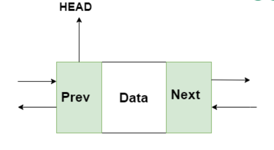
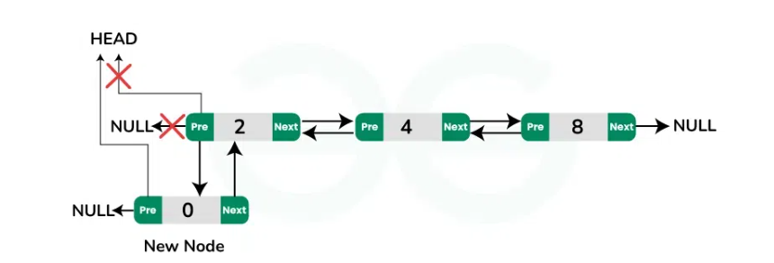
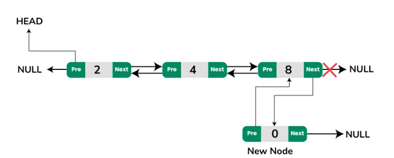

# Lab: Doubly Linked List in C++

## 1. Introduction

A Doubly Linked List (DLL) is a data structure that consists of nodes where each node contains three components:

- **Data**: The value stored in the node.
- **Next Pointer**: A pointer to the next node in the sequence.
- **Previous Pointer**: A pointer to the previous node in the sequence.


Unlike a singly linked list, a DLL allows traversal in both forward and backward directions, making it more versatile in certain applications.
###  Doubly LinkList Representation


## 2. Advantages of DLL

- **Bi-Directional Traversal**: Enables moving both forward and backward through the list.
- **Efficient Insertions and Deletions**: Operations at both ends or at specific positions are easier compared to singly linked lists.
- **Improved Flexibility**: Useful in applications like undo/redo operations, navigation systems, and dynamic memory management.

## 3. Node Structure in C++

The structure of a node in a doubly linked list can be defined as:

```cpp
struct Node {
    int data;
    Node* next;
    Node* prev;
    Node(int value) : data(value), next(nullptr), prev(nullptr) {}
};
```

Each node contains data, a pointer to the next node, and a pointer to the previous node.

## 4. Common Operations in DLL

### a. Insertion
- At the beginning
- At the end
- At a specific position

### b. Deletion
- From the beginning
- From the end
- From a specific position

### c. Traversal
- Forward traversal
- Backward traversal

### d. Search
- Find if a value exists in the list.

### e. Reversing the List
- Reversing the pointers to swap directions of traversal.

## 5. Code Implementation in C++ with Dry Runs and Explanations

### 5.1 Insert at Beginning

**Algorithm:**
1. Create a new node.
2. Assign the value to the node's data.
3. Set `newNode->next` to the current head.
4. Update the head to point to `newNode`.



**Code with Line-by-Line Explanation:**

```cpp
void insertAtBeginning(Node*& head, int value) {
    Node* newNode = new Node(value); // Step 1: Create a new node
    newNode->next = head;           // Step 2: Link new node to the current list
    if (head != nullptr) {
        head->prev = newNode;       // Step 3: Update previous of current head
    }
    head = newNode;                 // Step 4: Update head to point to new node
}
```

**Dry Run:**

| Step | Action                      | Head  | Tail  |
|------|-----------------------------|-------|-------|
| 1    | Create a new node with 10   | 10    | 10    |
| 2    | Point `newNode->next` to NULL | 10    | NULL  |
| 3    | Update head to `newNode`    | 10    | NULL  |

**Result:** `10 -> NULL`

### 5.2 Insert at End

**Algorithm:**
1. Create a new node.
2. Assign the value to the node's data.
3. Set `newNode->next` to NULL.
4. If the list is empty, set head to `newNode`.
5. Otherwise, traverse to the last node.
6. Update the last node’s next to point to `newNode`.



**Code with Line-by-Line Explanation:**

```cpp
void insertAtEnd(Node*& head, int value) {
    Node* newNode = new Node(value);  // Step 1: Create a new node
    if (head == nullptr) {            // Step 2: Check if the list is empty
        head = newNode;               // Step 3: Update head if list is empty
        return;
    }
    Node* temp = head;                // Step 4: Start at the head
    while (temp->next != nullptr) {   // Step 5: Traverse to the last node
        temp = temp->next;
    }
    temp->next = newNode;             // Step 6: Link the last node to the new node
    newNode->prev = temp;             // Step 7: Update the new node's previous pointer
}
```

**Dry Run:**

| Step | Action                      | Head  | Tail  |
|------|-----------------------------|-------|-------|
| 1    | Create a new node with 20   | 10    | 20    |
| 2    | Traverse to last node (10)  | 10    | 20    |
| 3    | Set `lastNode->next` to `newNode` | 10 -> 20 | NULL  |

**Result:** `10 -> 20 -> NULL`

### 5.3 Delete a Node

**Algorithm:**
1. If the list is empty, print a message and exit.
2. If the first node contains the value:
   - Update head to `head->next`.
   - Delete the first node.
3. Traverse to the node before the one to delete.
4. Update `temp->next` to skip the node to delete.
5. Delete the unwanted node.

**Code with Line-by-Line Explanation:**

```cpp
void deleteNode(Node*& head, int value) {
    if (head == nullptr) {               // Step 1: Check if the list is empty
        cout << "List is empty!\n";
        return;
    }
    if (head->data == value) {          // Step 2: Check if the first node has the value
        Node* temp = head;              // Step 3: Store head in a temporary variable
        head = head->next;              // Step 4: Update head to the next node
        if (head != nullptr) {
            head->prev = nullptr;       // Step 5: Update previous of new head
        }
        delete temp;                    // Step 6: Delete the old head
        return;
    }
    Node* temp = head;                  // Step 7: Start at the head
    while (temp->next != nullptr && temp->next->data != value) { // Step 8: Traverse to find the value
        temp = temp->next;
    }
    if (temp->next == nullptr) {        // Step 9: If value is not found
        cout << "Value not found!\n";
    } else {
        Node* delNode = temp->next;     // Step 10: Store the node to delete
        temp->next = delNode->next;     // Step 11: Skip the node to delete
        if (delNode->next != nullptr) {
            delNode->next->prev = temp; // Step 12: Update previous pointer of the next node
        }
        delete delNode;                 // Step 13: Delete the unwanted node
    }
}
```

**Dry Run:**

| Step | Action                   | Head  | Tail  |
|------|--------------------------|-------|-------|
| 1    | Traverse to node before 20 | 10    | 20    |
| 2    | Update `temp->next` to skip 20 | 10    | NULL  |
| 3    | Delete node 20           | 10    | NULL  |

**Result:** `10 -> NULL`

## 6. Applications

- **Web Browsers**: Navigating forward and backward through browser history.
- **Undo/Redo Operations**: Used in text editors and design software.
- **Implementation of Deques**: Used for efficient addition/removal from both ends.
- **Operating Systems**: Managing memory allocation using paging.

## 7. Time Complexity Analysis

| Operation   | Time Complexity |
|-------------|-----------------|
| Insertion   | O(1)            |
| Deletion    | O(1)            |
| Traversal   | O(n)            |
| Search      | O(n)            |
| Reversal    | O(n)            |

## 8. Comparison: DLL vs Singly Linked List vs Array

| Feature           | DLL               | Singly Linked List | Array          |
|-------------------|-------------------|--------------------|----------------|
| Traversal         | Forward & Backward | Forward Only       | Index-based    |
| Insertion/Deletion| O(1)              | O(1)               | O(n)           |
| Memory Usage      | More (extra pointer) | Less              | Fixed or Dynamic |

## 9. Conclusion

The Doubly Linked List is a versatile and powerful data structure that offers flexibility in bi-directional traversal and efficient insertion/deletion. It is widely used in scenarios requiring dynamic memory management and applications like undo-redo systems, making it an essential concept for data structure learning.

```cpp
#include <iostream>
using namespace std;

// Node structure for the doubly linked list
struct Node {
    int data;                 // Data to store in the node
    Node* next;              // Pointer to the next node
    Node* prev;              // Pointer to the previous node

    // Constructor to initialize the node with a value
    Node(int value) : data(value), next(nullptr), prev(nullptr) {}
};

// Function to insert a node at the beginning of the list
void insertAtBeginning(Node*& head, int value) {
    Node* newNode = new Node(value);  // Step 1: Create a new node
    newNode->next = head;            // Step 2: Link the new node to the current head
    if (head != nullptr) {
        head->prev = newNode;        // Step 3: Update the previous pointer of the current head
    }
    head = newNode;                  // Step 4: Update head to point to the new node
}

// Function to insert a node at the end of the list
void insertAtEnd(Node*& head, int value) {
    Node* newNode = new Node(value); // Step 1: Create a new node
    if (head == nullptr) {           // Step 2: Check if the list is empty
        head = newNode;              // Step 3: Set head to the new node if the list is empty
        return;
    }
    Node* temp = head;               // Step 4: Start from the head
    while (temp->next != nullptr) {  // Step 5: Traverse to the last node
        temp = temp->next;
    }
    temp->next = newNode;            // Step 6: Link the last node to the new node
    newNode->prev = temp;            // Step 7: Update the new node's previous pointer
}

// Function to delete a node by value
void deleteNode(Node*& head, int value) {
    if (head == nullptr) {               // Step 1: Check if the list is empty
        cout << "List is empty!\n";
        return;
    }
    if (head->data == value) {           // Step 2: Check if the first node has the value
        Node* temp = head;               // Step 3: Store the head node in a temporary variable
        head = head->next;               // Step 4: Update head to the next node
        if (head != nullptr) {
            head->prev = nullptr;        // Step 5: Update the previous pointer of the new head
        }
        delete temp;                     // Step 6: Delete the old head node
        return;
    }
    Node* temp = head;                   // Step 7: Start from the head
    while (temp->next != nullptr && temp->next->data != value) { // Step 8: Traverse to find the value
        temp = temp->next;
    }
    if (temp->next == nullptr) {         // Step 9: If the value is not found
        cout << "Value not found!\n";
    } else {
        Node* delNode = temp->next;      // Step 10: Store the node to delete
        temp->next = delNode->next;      // Step 11: Skip the node to delete
        if (delNode->next != nullptr) {
            delNode->next->prev = temp;  // Step 12: Update the previous pointer of the next node
        }
        delete delNode;                  // Step 13: Delete the unwanted node
    }
}

// Function to traverse the list in forward direction
void traverseForward(Node* head) {
    while (head != nullptr) {             // Step 1: Iterate through the list
        cout << head->data << " -> ";   // Step 2: Print the data
        head = head->next;               // Step 3: Move to the next node
    }
    cout << "NULL\n";                  // Step 4: End of list
}

// Function to traverse the list in backward direction
void traverseBackward(Node* tail) {
    while (tail != nullptr) {             // Step 1: Iterate through the list in reverse
        cout << tail->data << " -> ";   // Step 2: Print the data
        tail = tail->prev;               // Step 3: Move to the previous node
    }
    cout << "NULL\n";                  // Step 4: End of list
}

// Main function to demonstrate the doubly linked list
int main() {
    Node* head = nullptr;                 // Step 1: Initialize the head to null

    // Insert nodes at the beginning
    insertAtBeginning(head, 10);
    insertAtBeginning(head, 20);
    insertAtBeginning(head, 30);
    cout << "List after inserting at beginning:\n";
    traverseForward(head);

    // Insert nodes at the end
    insertAtEnd(head, 40);
    insertAtEnd(head, 50);
    cout << "List after inserting at end:\n";
    traverseForward(head);

    // Delete a node
    deleteNode(head, 20);
    cout << "List after deleting 20:\n";
    traverseForward(head);

    // Traverse the list in reverse
    cout << "List in reverse order:\n";
    Node* tail = head;
    while (tail->next != nullptr) {       // Find the last node
        tail = tail->next;
    }
    traverseBackward(tail);

    return 0;                             // End of program
}
```